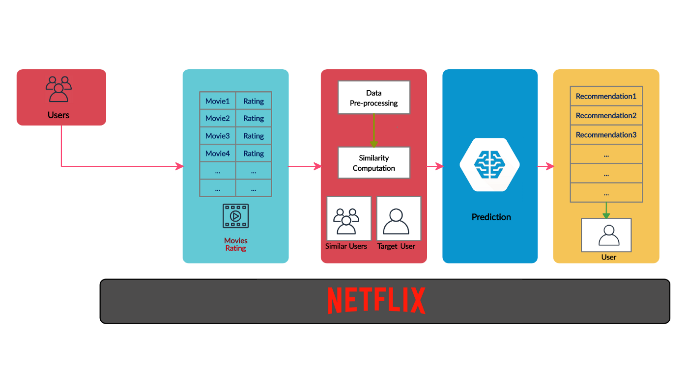

# Collaborative Filtering Recommendation Engine

   

## Within Collaborative Filtering, there are two main branches:

* Model-Based Collaborative Filtering
* Neighborhood Based Collaborative Filtering

This practices the implementation of Neighborhood Based Collaborative Filtering. 

## Similarity Metrics
In order to implement Neighborhood Based Collaborative Filtering, you were introduced to and applied a few techniques to assess how similar or distant two users were from one another:

* Pearson's correlation coefficient
* Spearman's correlation coefficient
* Kendall's Tau
* Euclidean Distance
* Manhattan Distance

## Business Cases For Recommendations
Finally, you looked at the four ideas needed for businesses to implement successful recommendations to drive revenue, which include:

* Relevance
* Novelty
* Serendipity
* Increased Diversity
